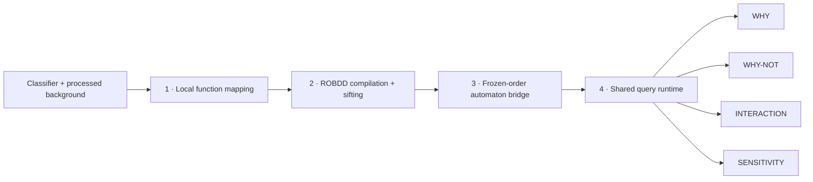

<div align="center">

# ReQ-CAPS

### One local circuit. One automaton. Four audit queries.

**Logic-Circuit and Automaton Semantics for Auditable Post-Hoc Explanation**

[](https://github.com/7WD1/TETCpapercode/actions/workflows/tests.yml)


[Quick start](#quick-start) · [Method](#method-at-a-glance) · [Semantics](#read-the-guarantees-correctly) · [Configuration](#configuration) · [Developer guide](docs/development.md)

</div>

---

ReQ-CAPS turns a numeric tabular classifier's local reconstructed behavior into an explicit Boolean circuit and a matching finite-state runtime. WHY, WHY-NOT, INTERACTION and SENSITIVITY reuse that same object; they do not resample the classifier or rebuild the circuit for each question.

This repository provides an executable **reference implementation of the method** described in the ReQ-CAPS manuscript submitted to IEEE TETC. The release contains implementation code, configuration, documentation and small correctness tests. Reproducing the manuscript's quantitative benchmarks requires the original fitted models, dataset versions, frozen splits and experiment records, which are outside this method release.

## Method at a glance



| Stage | Implemented behavior | Source |
| :--- | :--- | :--- |
| **LFM** | Background-substitution label-change importance; deterministic TopK; median thresholds; conditional means; degenerate-feature removal; bounded Boolean sampling | [`mapping.py`](src/reqcaps/mapping.py) |
| **Compile** | Positive construction minterms; reduced ordered BDD; natural, importance, or Rudell-style sifting order; explicit node budget | [`bdd.py`](src/reqcaps/bdd.py) |
| **CAB** | Frozen post-sifting schedule; decision and terminal states; explicit skipped-layer debt states; vectorized batch transitions; replayable traces | [`automaton.py`](src/reqcaps/automaton.py) |
| **UESS** | Exact minimum-cardinality WHY; single-bit WHY-NOT; non-additive pairwise interactions; exact sphere counts and weighted nearest flips; shared point and family caches | [`queries.py`](src/reqcaps/queries.py) |

The portable BDD backend uses ordinary edges and a unique table. Its sifting procedure moves each variable through candidate positions, rebuilds the same Boolean function and retains strictly smaller graphs. It is **not CUDD**, and it does not claim bit-for-bit equivalence with a CUDD ordering heuristic or the historical timing environment.

## Quick start

```bash
git clone https://github.com/7WD1/TETCpapercode.git
cd TETCpapercode
python -m venv .venv
# Windows: .venv\Scripts\activate
# Linux/macOS: source .venv/bin/activate
python -m pip install -e ".[test]"
python -m pytest -q
```

Only NumPy is required at runtime. A deterministic scikit-learn-compatible `predict(X)` object or a deterministic callable returning one scalar class label per row can be used. Keep the predictor and preprocessing fixed during construction. Numeric and string class labels are retained without assuming a class numbered `1`.

```python
import numpy as np
from reqcaps import Config, ReQCAPS

def classifier(X):
    return ((X[:, 0] > 0) & (X[:, 1] > 0)).astype(int)

background = np.array([[-1., -1.], [-1., 1.], [1., -1.], [1., 1.]])
engine = ReQCAPS(Config(feature_budget=2, seed=42))
artifact = engine.build(classifier, np.array([1., 1.]), background)

# Build once; these calls query the existing circuit/DFA only.
answers = artifact.answer_all()
why = answers["why"]["canonical_original_indices"]
profile = answers["sensitivity"]["profile"]
weighted = artifact.runtime.answer("sensitivity", costs=[1., 2.])
trace = artifact.automaton.trace([0, 1])
```

This example does not print results or write files. The library performs no network access and runs no experiments on import.

### CLI

Prepare a module containing a predictor and numeric CSVs with **no header**, using the same processed feature columns in both files. Then:

```bash
reqcaps --model my_model:predict \
  --background background.csv --instances instances.csv \
  --config configs/default.json
```

The command builds and queries quietly. It creates no result file unless an explicit `--output artifact.json` option is supplied. `--factory` calls a no-argument model factory instead of treating the imported attribute as the predictor. There is no automatic model training or dataset download. See [`docs/api.md`](docs/api.md) for the API, schema and batch requests.

## Read the guarantees correctly

Two functions have different meanings:

1. **Reconstructed target**: `f_x(v) = 1[predict(rho_x(v)) == predict(x)]`. Outside the queried codes its value is **unknown**, not zero.
2. **Compiled function**: `G(v)` is the OR of the **positive construction minterms**. At an unconstructed code it returns zero by the explicit closed-world extension. This zero is a circuit value, not an observed classifier label.

`G` matches every construction label exactly. With full Boolean construction it matches the reconstructed target on the whole finite domain. The bridge preserves `G` under the frozen input schedule. Neither property establishes fidelity to every continuous input, causal effects, actionable recourse or a classifier's global behavior.

Each answer reports `status: exact_on_compiled_object` when its circuit query is exact. Separate `raw_target_status`, `raw_minimum_certified`, support statuses and sensitivity bounds expose whether the **queried reconstructed target evidence** justifies the same claim. Missing evidence produces `unknown`; known mismatches produce `known_disagreement`. A finite sample is never turned into a certificate of global robustness.

| Query | Meaning and correctness limit |
| :--- | :--- |
| **WHY** | All minimum-cardinality subsets whose fixed center literals imply the compiled center output. Includes an empty reason for a constant function; lexicographic original-feature tie-break. If the subset budget expires, the minimum is returned as unknown. |
| **WHY-NOT** | Bits whose individual flip changes the compiled center output. This is the manuscript's single-bit overturning set; it is not a full enumeration of all counterfactual edits. |
| **INTERACTION** | `abs(G(v_ij) - G(v_i) - G(v_j) + G(v))`, in `{0,1,2}`; normalized magnitude divides by 2. This is a pointwise Boolean effect. |
| **SENSITIVITY** | Exact disagreement counts on every Hamming sphere, from integer dynamic programming; exact weighted closest compiled flip with a witness. `distance: null, robust: true` represents no compiled flip, and certifies the reconstructed target only when equivalence is established. |

Conditional-mean reconstruction operates in the **processed numeric model space**. It does not automatically preserve raw-domain categorical, one-hot, relational, legal or actionability constraints. Supply `validity(X)` to reject inadmissible processed vectors; rejection remains explicit. If reconstruction changes the audited center label, `center_reconstruction_disagreement` requires review. No answer is presented as a certified explanation of the original decision in that case.

## Configuration

[`configs/default.json`](configs/default.json) uses `k=10`, `M0=50`, enumeration limit `15`, Hamming radius `3`, near budget `2000`, far budget `200`, seed `42`, a `50,000`-node limit and a `100,000`-subset WHY limit. It uses **full construction** whenever the retained dimension permits enumeration.

| Mode | Construction / audit split | Interpretation |
| :--- | :--- | :--- |
| **Exact finite-domain mode** — default, `holdout_fraction=0` | Full cube used for construction; disjoint Boolean hold-out does not exist, so hold-out fidelity is `null` | Exact semantics for the reconstructed finite function; no invented held-out score |
| **Sampled mode** — `n > enumeration_limit` | Budgeted near/far construction; independent disjoint audit codes where available | Exact on construction; extension risk visible in actual hold-out fidelity and evidence statuses |
| **Split construction mode** — [`split-construction.json`](configs/split-construction.json) | 20% of sampled codes held out, keeping the center in construction | Recreates a split setting honestly; held-out positives are rejected by the positive-minterm extension and can fail the fidelity guard |

The near sampler enumerates the complete Hamming ball when it fits the budget; otherwise it samples unique near codes and reports `near_complete: false`. Budgets are upper bounds; a finite domain or duplicate draws can yield fewer points. Hold-out codes are always disjoint from construction. Black-box counts refer to evaluated rows after deterministic input caching and include screening and the original anchor separately from reconstruction calls.

For a workload, use `build_batch` once and `answer_batch` repeatedly. Each audited instance retains its own local circuit/DFA pair; sharing occurs across requests to that object. Batched DFA execution uses NumPy transition-table gathers. This reference backend does not claim multithreaded speedups or the manuscript's reported throughput.

## Verification and release scope

The tests use tiny synthetic Boolean oracles and processed numeric inputs to check compilation, sifting, reordered input schedules, debt states, minimum reasons, weighted witness optimality, exact sphere counts, unknown-value semantics, budget failures, disjoint hold-outs and cache reuse. They do not train benchmark models or calculate the paper's performance tables. CI runs these correctness tests on Python 3.10 and 3.12.

See [`docs/method.md`](docs/method.md) for the algorithm mapping, [`docs/development.md`](docs/development.md) for validation commands and complexity, and [`CITATION.cff`](CITATION.cff) for citation metadata.

**Licensing:** A reuse license has not been specified by the rights holder; see [`LICENSING.md`](LICENSING.md).

